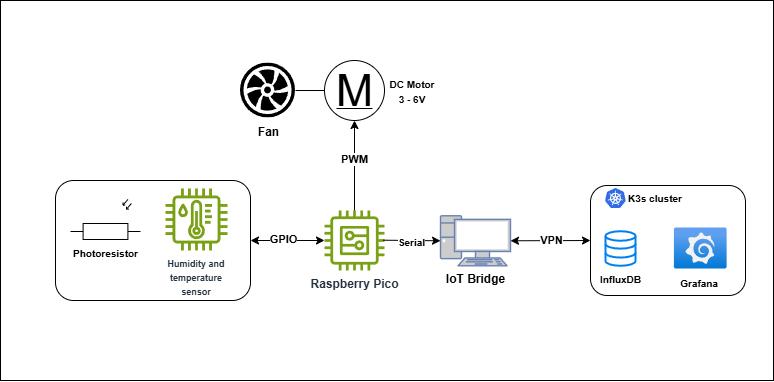

# iot-thermal-telemetry-stack
This project was designed to present small iot telemetry stack focused on thermal comfort. 
## Key concepts
* **Data Aquisition** - Raspberry Pi Pico (RPi) is used to collect environmental data with various sensors.
* **Thermal Comfort Analytics** - Unlike standard thermometers, this stack calculates **PMV (Predicted Mean Vote)** and **PPD (Predicted Percentage Dissatisfied)** in real-time to assess true human comfort.
* **Active Ventilation Simulation (PWM Control):** Features a custom-built ventilation engine where fan intensity is dynamically adjusted via **PWM (Pulse Width Modulation)** based on real-time temperature gradients, simulating an automated HVAC response.
* **Cloud-Native Observability** - Uses a modern DevOps stack (k3s, InfluxDB 2.x, Grafana) to store and visualize time-series data with high availability in mind.
  
## Architecture 

