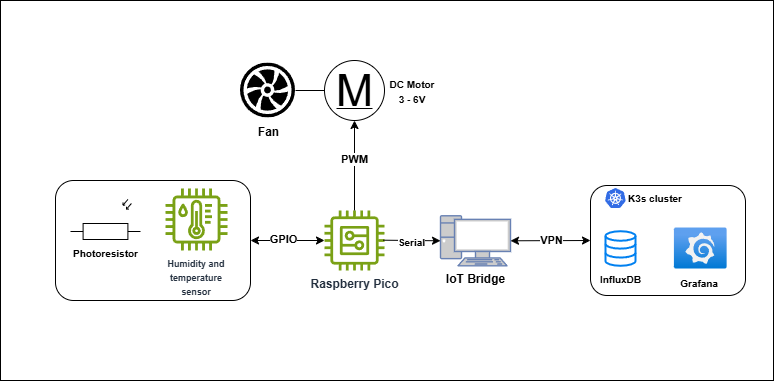

# iot-thermal-telemetry-stack
This project was designed to present a small IoT telemetry stack focused on thermal comfort. 
## Key concepts
* **Data Aquisition** - Raspberry Pi Pico (RPi) is used to collect environmental data with various sensors.
* **Thermal Comfort Analytics** - Unlike standard thermometers, this stack calculates **PMV (Predicted Mean Vote)** and **PPD (Predicted Percentage Dissatisfied)** in real-time to assess true human comfort.
* **Active Ventilation Simulation (PWM Control):** Features a custom-built ventilation engine where fan intensity is dynamically adjusted via **PWM (Pulse Width Modulation)** based on real-time temperature gradients, simulating an automated HVAC response.
* **Cloud-Native Observability** - Uses a modern DevOps stack (k3s, InfluxDB 2.x, Grafana) to store and visualize time-series data with high availability in mind.
  
## Architecture 


## File Structure & Code Breakdown

### 1. `home-lab-sensors.py` (MicroPython Edge Firmware)
Designed to run directly on the Raspberry Pi Pico. It handles hardware abstraction, sensor aggregation, and autonomic edge-control:
* **Hardware Setup:** * **DHT11:** Temperature and Humidity sensor connected to Pin 2.
  * **Photoresistor (LDR):** Connected via Analog-to-Digital Converter (ADC Pin 27) to calculate light intensity in **Lux** using the non-linear Gamma curve equation:     
$`\gamma = 0.6, \quad R_{\text{LDR}} = \left(\frac{65535}{\text{raw\_adc}} - 1\right) \times R_{\text{fixed}}`$

  * **PWM Fan Control:** Governed by Pin 16 with a frequency of 1000Hz. Adjusts duty cycle smoothly from 0% ($24^\circ\text{C}$) to 100% ($28^\circ\text{C}$).
  * **I2C LCD:** Updates every 5 seconds to present raw telemetric readouts local to the deployment.

### 2. `main.py` (Gateway & Comfort Engine)
A Python 3 gateway script meant to execute on a host computer or single-board computer (like a Raspberry Pi) connected to the Pico over USB:
* **Ingestion:** Reads serial data stream line-by-line via `/dev/ttyACM0` at a baud rate of 115200.
* **Climatological Moving Median:** Maintains a historical rolling queue (`deque` max length 80) of ambient temperatures to simulate Mean Radiant Temperature ($\bar{T}_r$), crucial for accurate comfort index formulation.
* **ISO 7730 Formulation:** Executes Fanger's comfort calculations under static assumptions suited for indoor office space:
  * Metabolic rate ($\text{Met}$) = $1.4$ (Light activity/sitting)
  * Clothing insulation ($\text{Clo}$) = $0.5$ (Summer indoor attire)
  * Air velocity ($v_r$) = $0.1\text{ m/s}$
* **Time-Series InfluxDB Pipeline:** Connects securely using credentials injected via environmental variables (`.env`) and structures the fields (`temperature`, `humidity`, `light_intensity`, `fan_power`, `pmv`, `ppd`) into InfluxDB Points written synchronously.

---

## Installation & Setup

### Prerequisites
* Raspberry Pi Pico or Pico W
* Connected hardware components: DHT11, LDR Photoresistor, $16\times2$ I2C LCD, 5V/12V PWM Fan (with appropriate transistor/MOSFET driver circuitry)
* Python 3.10+ installed on host machine
* Running InfluxDB 2.x instance (Local or orchestrated via k3s/Docker)

### Hardware Pin Mapping
| Component | Pico Pin | Type / Protocol |
| :--- | :--- | :--- |
| **LCD SDA** | Pin 0 | I2C0 |
| **LCD SCL** | Pin 1 | I2C0 |
| **DHT11 Data** | Pin 2 | Digital Input |
| **PWM Fan Control** | Pin 16 | PWM Output |
| **Photoresistor (LDR)** | Pin 27 | ADC Input (ADC1) |

### Edge Deployment (Pico)
1. Transfer the `pico_i2c_lcd.py` (and its dependent `lcd_api.py` drivers) onto the Pico root storage.
2. Rename `home-lab-sensors.py` to `main.py` and upload it to the Pico flash storage using Thonny or `ampy` so it boots autonomously upon power-up.

### Gateway Deployment (Host)
1. Clone this repository onto your gateway host machine.
2. Install required library stack dependencies:
   ```bash
   pip install -r requirements.txt
3. Create a `.env` file in the same directory as `main.py` and populate your cloud-native platform connection parameters:
   ```env
   INFLUXDB_URL=http://your-k3s-or-local-influx-ip:8086
   INFLUXDB_TOKEN=your_super_secret_auth_token
   INFLUXDB_ORG=your_organization_name
   INFLUXDB_BUCKET=your_telemetry_bucket
   ```
4. Execute the connector script:
   ```bash
   python main.py
